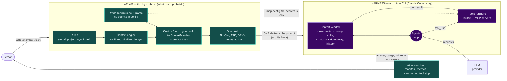
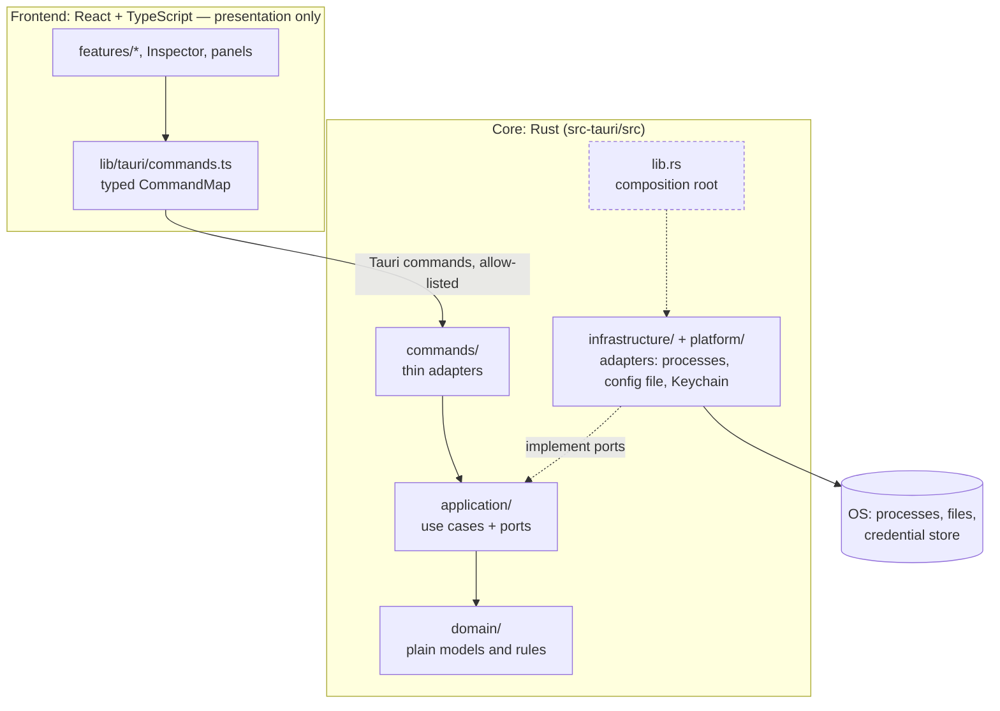
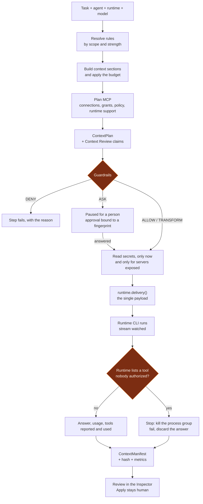
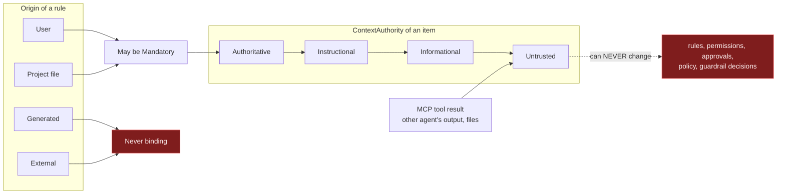
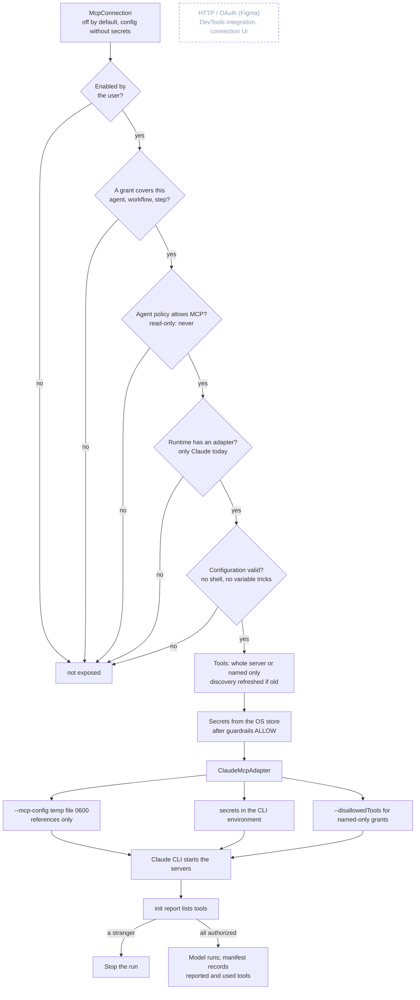

# Atlas in diagrams

Pictures of what the code does today. They are [Mermaid](https://mermaid.js.org) (GitHub, VS Code and most viewers draw them; the source stays in git
and is reviewed like code). Every box exists in the code; what does not exist yet is drawn dashed and says so. The words behind each picture are in
[context-and-tooling-platform.md](context-and-tooling-platform.md).

## 1. Atlas and the agent harness

A coding-agent **harness** (Claude Code, Codex, Gemini CLI…) holds the context window, runs the agentic loop and executes the tools. Atlas does not
replace it: **Atlas sits one level above, decides what goes into the harness, and watches what comes back.** That is the main difference from the
usual "harness" picture.

How each box of the usual picture maps:

| In the usual picture      | In Atlas                                                                                                                                                                                  |
| ------------------------- | ----------------------------------------------------------------------------------------------------------------------------------------------------------------------------------------- |
| System prompt             | The runtime's own is **not Atlas's** (surface entry "runtime controlled"). Atlas's instructions travel inside the prompt body (`SystemPromptChannel::Unsupported` for all five runtimes). |
| Rules (`CLAUDE.md`)       | Atlas has its own Rules (`.atlas/context/rules.md`, `UserConfig.rules`, task rules). The user's `CLAUDE.md` is loaded by the CLI and Atlas lists it as "not observed".                    |
| Skills                    | Turned off for Claude runs (`--disable-slash-commands`).                                                                                                                                  |
| Tool schemas / MCPs       | Atlas decides **which servers and tools** (grants, plan). It does not see schemas or descriptions (unknown, so `tool_definitions` is Unknown in the budget).                              |
| `Memory.md`               | Not built. Memory is designed (doc section 6), explicitly postponed.                                                                                                                      |
| History                   | Part of the prompt Atlas assembles (conversation and task context), under the same budget and priorities.                                                                                 |
| Context window / payload  | The **Manifest**: what was delivered, with a SHA-256 of the exact payload. What the CLI adds around it is shown as unobserved, never claimed.                                             |
| Agentic loop              | Owned by the harness. Atlas starts it, can stop it, and sees only what the CLI reports.                                                                                                   |
| Tools executed in harness | Same. Atlas never runs a tool itself and has no MCP gateway or proxy.                                                                                                                     |

## 2. Layers of the application

The webview never touches files, processes, Git, credentials or the network. Dependencies point inward (ADR 0002).

## 3. One step, from request to evidence

What `ExecutionService::run_step` does, in order.

## 4. Who decides what: authority and trust

Two axes that are never merged: **where content came from** (`SourceTrust`) and **what it is allowed to be for the model** (`ContextAuthority`).
Only the user's own rules can bind.

## 5. MCP: from a connection to a tool in a step

The dashed box is Phase E: not built.

## Keeping these true

A diagram that drifts is worse than none. When a step in section 3 or 5 changes in code, change it here in the same commit. The Mermaid blocks are
plain text, so a reviewer sees the diff.
